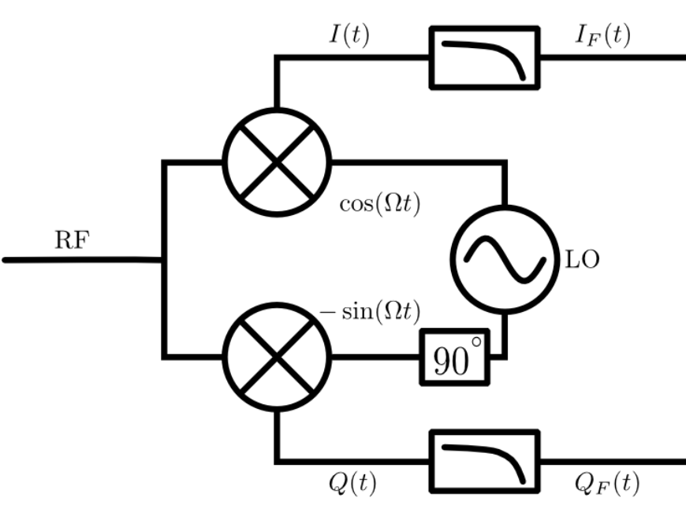

# Math & Physics Stuff
I document things I derived in my learning journey.

## Mathematics

### Euler's Formula & Identity
Using ODE to derive the generalized Euler's formula and the famous Euler's identity:
$$e^{i\pi} + 1 = 0$$

**[$\rightarrow$ Read more here](eulers_identity/index.html)**

### Nth Order Homogeneous ODE With Constant Coefficient Solution
A derivation of the general solution to the differential equation of the form

$$
y^{(n)} + a_1y^{(n - 1)} + a_2y^{(n - 2)} + ... + a_ny = 0
$$

is

$$
y = \sum_{k = 1}^{n}{C_{k1}e^{a_{k}x}\cos(b_{k}x) + C_{k2}e^{a_{k}x}\sin(b_{k}x)}
$$

**[$\rightarrow$ Read more here](ode_nth_order_homogeneous/index.html)**

## Physics and Engineering

### Natural Response of a Series LC Circuit
This section derives the natural response of a series LC circuit, showing how voltage and current oscillate sinusoidally at the natural frequency due to energy exchange between the inductor and capacitor.

**[$\rightarrow$ Read more here](rc_circuit_natural_response/index.html)**

### Phased Arrays
This secion derives the Uniform Linear Array steering law to be 

$$
\phi = \frac{2 \pi r \sin\theta}{\lambda} m
$$

using a simple two-element antenna array set up and far field EM wave approximations.

**[$\rightarrow$ Read more here](phased_arrays/index.html)**

### IQ Sampling Circuit Analysis
This secion examines the exact operations that each cicuit component applies to an RF signal to produce IQ data.

**[$\rightarrow$ Read more here](./iq_sampling/index.html)**