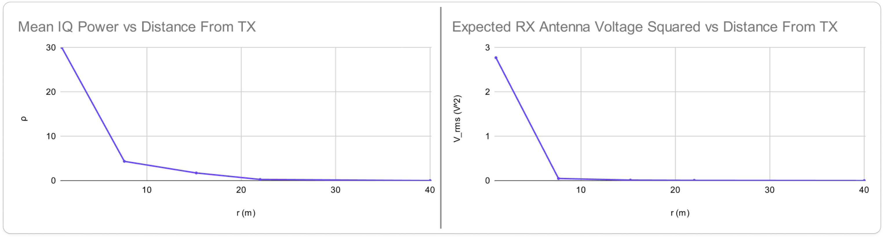
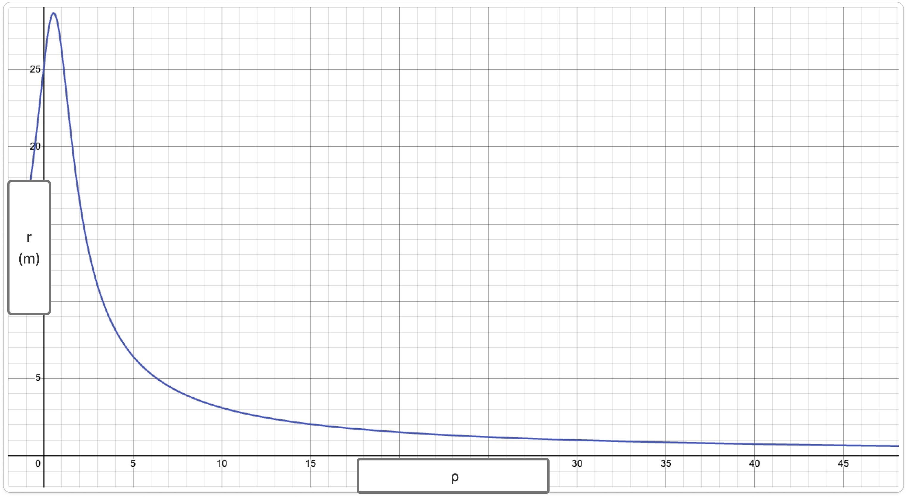

[$\leftarrow$ Back](../index.html)
### RF Transmission Range Estimation

Consider the following scenario. An RX SDR is receiving a signal transmission from a distance $r$. We are interested in estimating $r$. However, SDRs only provide [IQ samples](../iq_sampling/index.html) which contains no TX information. Furthermore, the IQ samples are relative to the SDR hardware which does not give us any real, absolute scalar values to work with.

This article will explore a limited method to estimate $r$ given the constraints described above.

*RX* denotes receiver.
*TX* denotes transmitter.

___

#### Power Loss in Free Space
RF transmission power decrease is characterized by the inverse square law. The same transmission power $p$ at a distance $r$ is
$$
p(r) = P D_1D_2\left( \frac{c}{4 \pi r f} \right)^2
$$

Where $P$ is the TX transmission power, $D_i$ are antenna directivity values, $c$ is the speed of light, $f$ is the transmission frequency, and $r$ is the RX distance from TX. This is the standard *Free Space Path Loss* (FSPL) equation.

#### RX Voltage
The transmitting power can be derived from $P = IV$ and *Ohm's Law* to be
$$
\begin{aligned}
P &= \frac{{V_\text{antenna}}^2}{z} \\
\iff V_\text{antenna} &= \sqrt{z P}
\end{aligned}
$$

The receiving power is almost the same with the exception that it is at a distance $r$ from TX so FSPL must be accounted for, thus
$$
\begin{aligned}
p(r) &= \frac{{V_\text{antenna}}^2}{z} \\
\iff V_\text{antenna} &= \sqrt{z p(r)}
\end{aligned}
$$

Substituting $p(r)$ with its expanded FSPL form to obtain
$$
\begin{aligned}
V_\text{antenna} &= \sqrt{z p(r)} \\
&= \sqrt{z P D_1D_2\left( \frac{c}{4 \pi r f} \right)^2} \\
&= \frac{c}{4 \pi r f} \sqrt{z P D_1D_2}
\end{aligned}
$$

We'll call this the *Voltage-Distance* function.
From the *Voltage-Distance* function above,
$$
\begin{aligned}
V_\text{antenna} &= \frac{c}{4 \pi r f} \sqrt{z P D_1D_2} \\
\\
\iff r &= \frac{c}{4 \pi V_\text{antenna} f} \sqrt{z P D_1D_2}
\end{aligned}
$$

We'll call this the *Distance Calculation* function.

This function can be used to calculate the RX distance $r$ from TX if we know the absolute voltage $V_\text{antenna}$ at the RX antenna. But we cannot calculate that value directly. That value must be calibrated and estimated. The next sections will discuss the method to approximate the absolute antenna voltage.

___

#### Mean IQ Power Relation to RX Voltage
Given a signal, its mean unitless power in terms of its IQ samples is
$$
P_\text{mean} = \frac{1}{N}\sum_{i=1}^{N}{I[i]^2 + Q[i]^2}
$$

Along with the signal's [absolute power](#rx-voltage), it can be observed that
$$P \propto P_\text{mean}$$
and
$$P \propto {V_\text{antenna}}^2$$

It would be reasonable to think that we can find a way to map between $P_\text{mean}$ and ${V_\text{antenna}}^2$. Assuming there is a mapping between the two quantities, then there is a function
$$
\hat{V}_\text{antenna}(\rho)
$$
which estimates the RX voltage at the antenna given a mean IQ power $\rho$.

#### Mapping Between IQ Mean Power and Antenna Voltage
The only way to meaningfully do this is to conduct data collection with specific hardware, for a specific setup. The following hardware and configurations are used:
- $P = 2\text{W}$ [Pxton Radio](https://a.co/d/03fpEvGm)
- $D = 3.28, z = 50 \Omega$ [Disco32 Monopole Blade Antennas ](https://disco32.com/collections/antennas/products/short-blade-antenna-30-512mhz)
- LimeSDR Mini v2.4
- Center frequency $f = 470 \text{MHz}$
- Bandwidth $= 2.4 \text{MHz}$

Use the voltage-distance equation in [RX Voltage](#rx-voltage) to produce an expected $v_\text{antenna}$ for distances $r$, then square it for the table below. Then record the mean IQ power calculated using the SDR at that same distance. For this data, the constants are filled in with the equipment list above. It would also be reasonable to say that at a distant sufficiently large, the received power is zero.

$$
\begin{aligned}
V_\text{antenna} &= \frac{c}{4 \pi r f} \sqrt{z P D_1D_2} \\
\\
&= \frac{c}{4 \pi r f} \sqrt{z P D^2} \\
\\
&= \frac{c D}{4 \pi r f} \sqrt{z P} \\
\\
&= \frac{3.28\ c}{4 \pi r \ 470 \cdot 10^6\text{Hz}} \sqrt{50\Omega \cdot 2\text{W}} \\
\end{aligned}
$$

 

**Keyout voltage squared and mean IQ power at different distances**

|$r$ (m)|${v_\text{antenna}}^2$ (V$^2$)|$\rho_\text{mean}$|
|-:|-:|-:|
|1|2.77187505|30|
|7.62|0.04773794356|4.34327|
|15.24|0.01193448589|1.72158|
|22|0.005727014566|0.261416|
|$\infin$|0|0|

 

It can be observed that the unitless mean IQ power and voltage squared follows an inverse square relationship as $r$ increases.

___
**BEGIN VERY IMPORTANT DISCLAIMER**

Because the SDR front-end contains nonlinear analog components (LNA, mixer, and ADC), the measured IQ power does not scale perfectly linearly with the RX voltage$^2$, which is implied [above](#mean-iq-power-relation-to-rx-voltage).

For the specific hardware configuration used in this experiment, the empirical data is well approximated by a quadratic regression:

$$
V_{\text{antenna}}^2 \approx a\rho^2 + b\rho + c
$$

This polynomial relationship should therefore be interpreted as an **empirical calibration model specific to the measurement setup**, rather than a fundamental physical law.

The coefficients of this regression are dependent on the SDR hardware, receiver gain settings, center frequency, and bandwidth. Changing any of these parameters requires recalibrating the mapping function.

**END VERY IMPORTANT DISCLAIMER**
___

For the specific hardware configuration used in this experiment, the collected data points are empirically well approximated by a quadratic regression
$$
{\hat{V}_\text{antenna}}^2 = (3.19 \cdot 10^{-3}) \rho^2 - (3.4 \cdot 10^{-3}) \rho + 4.28 \cdot 10^{-3} \\
\\
\implies \hat{V}_\text{antenna} = \sqrt{(3.19 \cdot 10^{-3}) \rho^2 - (3.4 \cdot 10^{-3}) \rho + 4.28 \cdot 10^{-3}}
$$

This function maps unitless mean IQ power values to absolute voltage values.

We'll call this the *Mean IQ Power-Voltage Mapping* function.

#### TX Distance Estimation
It is reasonable to modify the *Distance Calculation* function from [RX Voltage](#rx-voltage) to become a *Distance Estimation* function of $\rho$ by replacing $V_\text{antenna}$ with $\hat{V}_\text{antenna}$ to obtain

$$
\hat{r}(\rho) = \frac{c}{4 \pi \hat{V}_\text{antenna} f} \sqrt{z P D_1D_2}
$$

In the particular example that was set up in the section above, $\hat{r}$ becomes
$$
\hat{r}(\rho) = \frac{3.28 \ c \sqrt{50 \Omega \cdot 2 \text{W}}}{4 \pi \ 470 \cdot 10^6\text{Hz} \sqrt{(3.19 \cdot 10^{-3}) \rho^2 - (3.4 \cdot 10^{-3}) \rho + 4.28 \cdot 10^{-3}}}
$$

#### Pitfall

Because of the regression that is based on real-world observation, the graph does not agree completely with theoretical models. For example, in the setup above, a finite maximum occurs at $\rho \approx 0.53292$ even though the graph should extend to infinity. Theoretically, $\lim_{\rho \rightarrow 0^+} r(\rho) = \infin$ but $\hat{r}(\rho)$ does not behave the same way. This method of estimation should be used with consideration and complemented by safeguards, given the limitation explained above.
